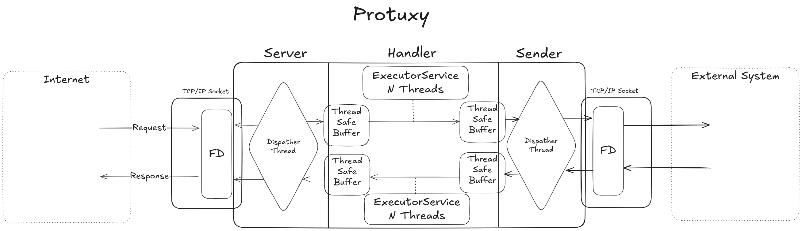

## High-Level Architecture

The application is structured into three main components: Acceptor, Sender, and Processor.

### Acceptor

The Acceptor is a server that works directly with the system socket. It accepts incoming byte arrays and places them into an internal buffer. It operates in a single thread, functioning as a dispatcher.

### Sender

The Sender is a client that works directly with the system socket to transmit data. It reads byte arrays from a buffer and writes them to the socket's output buffer. It operates in a single thread.

### Processor

The Processor is responsible for message routing, verification, and SSL termination. It reads byte arrays from a buffer, processes the messages, and places the resulting data into another buffer. It operates in a multithreaded environment.

### Architectural Diagram

